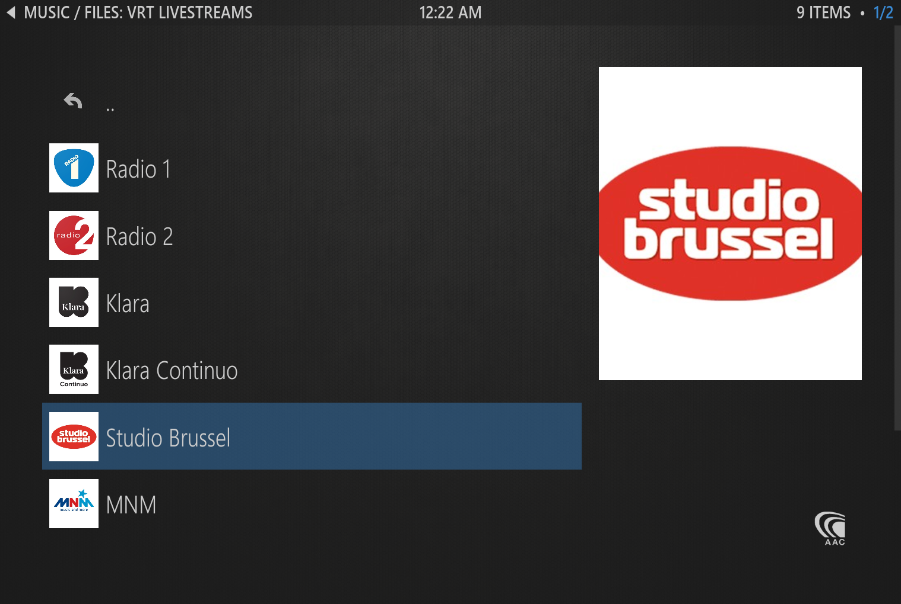
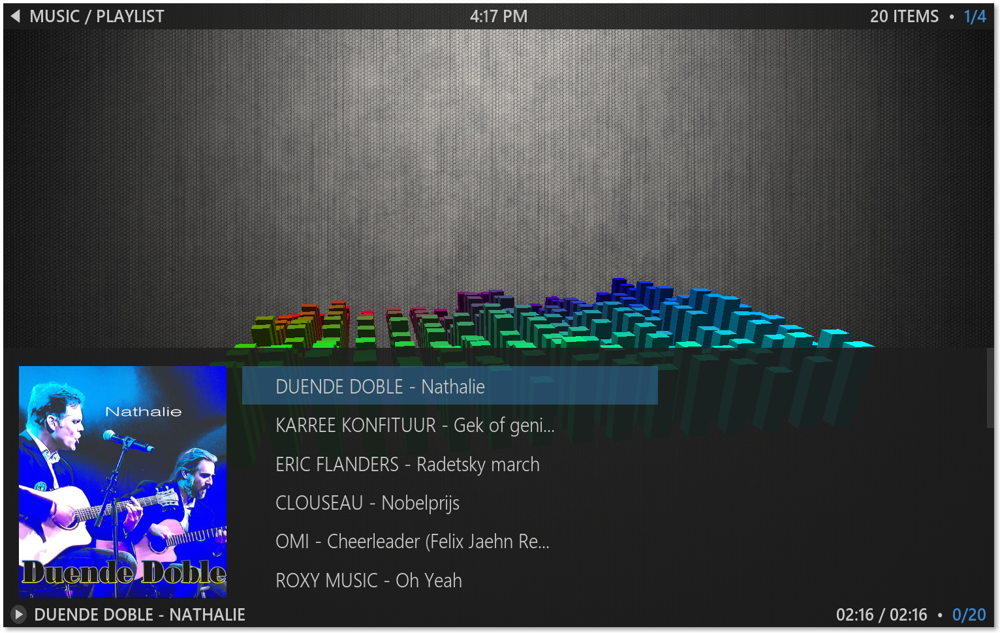
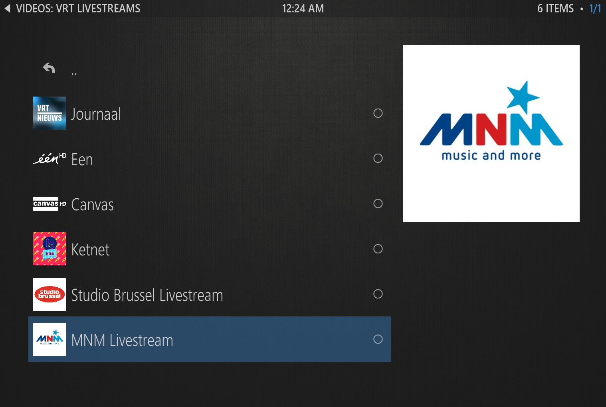

# VRT Kodi plugin

##Radio

Available channels include:

* Radio 1
* Radio 2
* Klara
* Klara Continuo
* Studio Brussel
* MNM
* MNM Hits
* Ketnet Hits
* VRT Nieuws

With playlist support

##TV

Available channels include

* één
* Canvas
* Ketnet
* Studio Brussel Live Webcam
* MNM Live Webcam

##Installation

TODO make a releasable zip and publish to repo
